# 🏨 Reservia - Système de Réservation d'Hôtel

## 📖 Description

Reservia est une application web de réservation d'hôtels permettant aux utilisateurs de rechercher des chambres, effectuer des réservations en ligne, gérer leurs réservations et effectuer des paiements sécurisés.

L'application offre une expérience utilisateur moderne et intuitive avec une interface responsive et des fonctionnalités avancées de gestion hôtelière.

---

## ✨ Fonctionnalités

### 👤 Gestion des utilisateurs

* Inscription et connexion des clients.
* Vérification de compte par e-mail.
* Gestion du profil utilisateur.
* Historique des réservations.

### 🏨 Gestion des chambres

* Consultation des chambres disponibles.
* Affichage détaillé des chambres.
* Recherche rapide des chambres.
* Gestion des disponibilités.

### 📅 Réservation

* Réservation en ligne des chambres.
* Vérification automatique des disponibilités.
* Génération de facture.
* Annulation de réservation.

### 💳 Paiement

* Paiement en ligne sécurisé.
* Validation des informations de paiement.
* Confirmation automatique de réservation.

### 📧 Notifications

* Envoi d'e-mails de confirmation.
* Vérification du compte utilisateur.
* Notifications liées aux réservations.

### 📊 Administration

* Tableau de bord administrateur.
* Gestion des réservations.
* Gestion des chambres.
* Suivi des statistiques.

---

## 🛠️ Technologies utilisées

### Frontend

* HTML5
* CSS3
* JavaScript
* Bootstrap

### Backend

* Spring Boot
* Spring Data JPA
* Hibernate

### Base de données

* MySQL

### Outils

* Git & GitHub
* IntelliJ IDEA
* Postman

---

## 📸 Captures d'écran

### Accueil

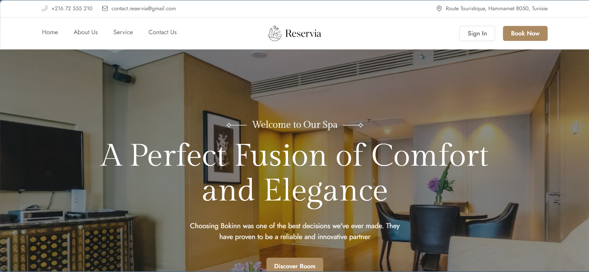

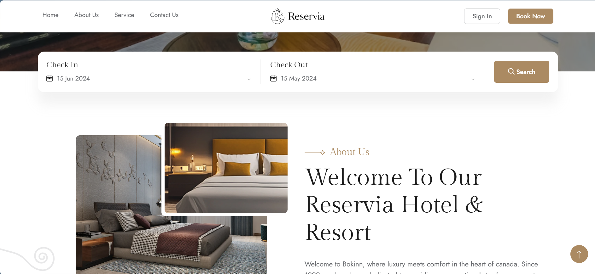

### À propos

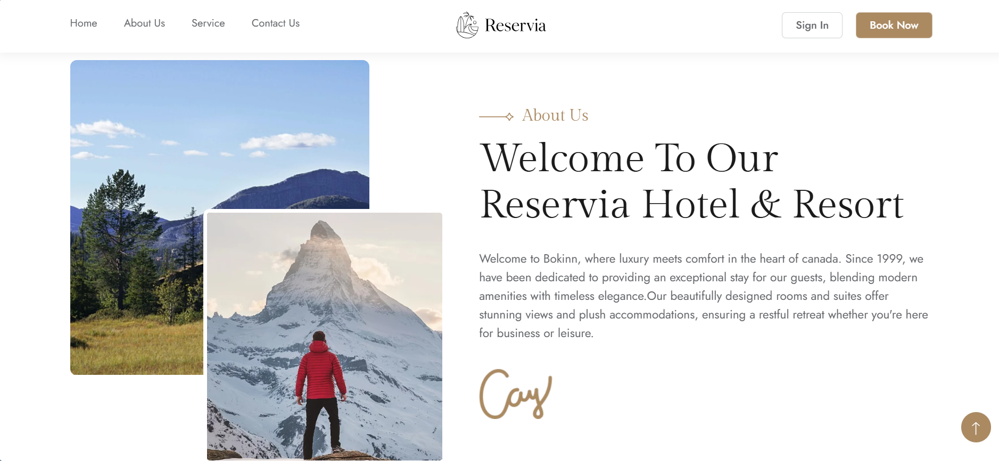

### Services

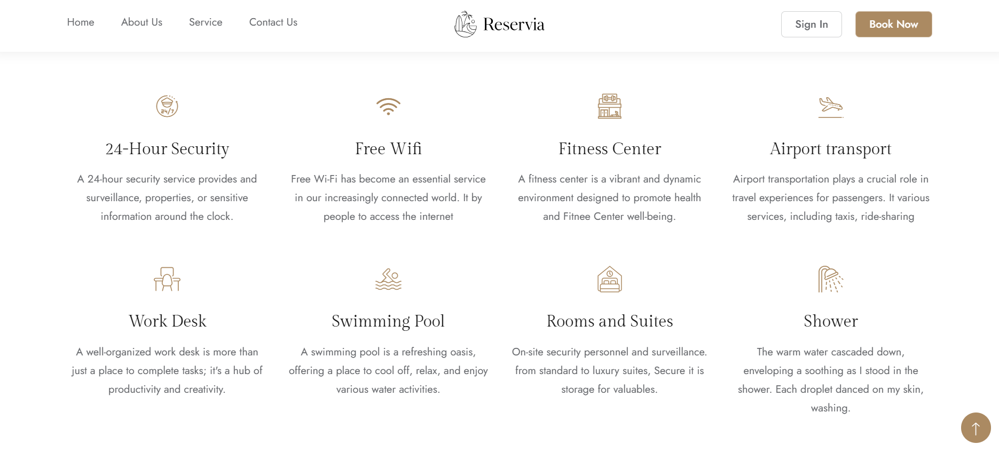

### Chambres

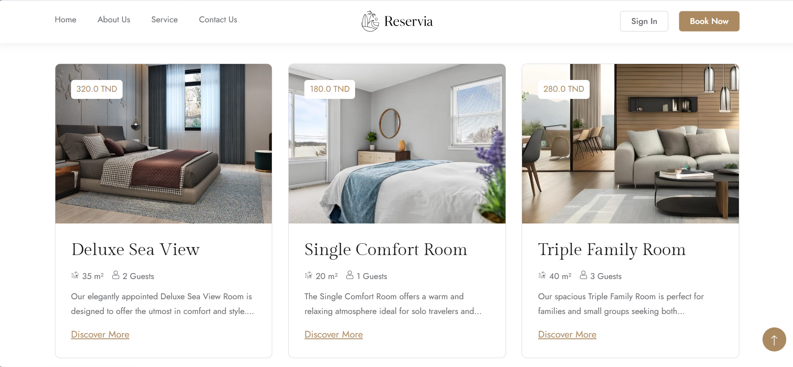

### Détails d'une chambre

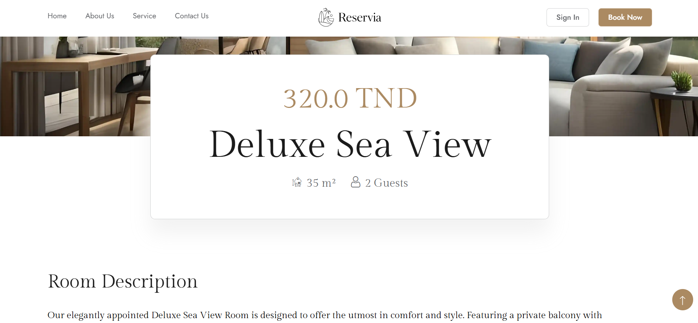

### Disponibilités

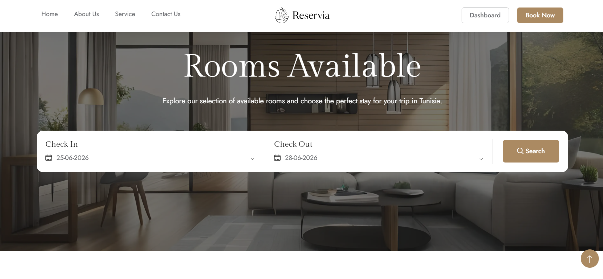

### Réservation

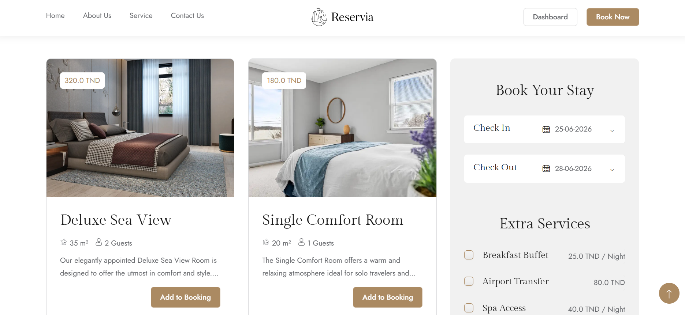

### Facture

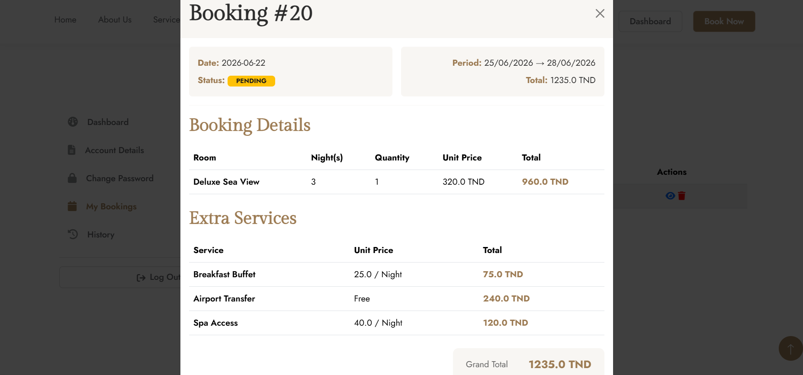

### Contact

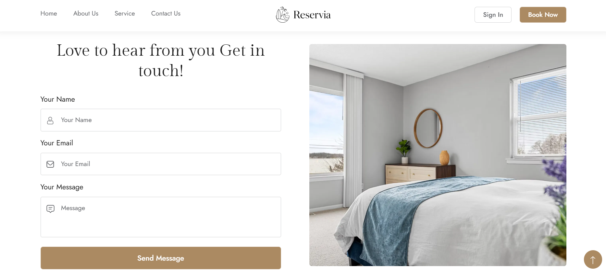

### Tableau de bord

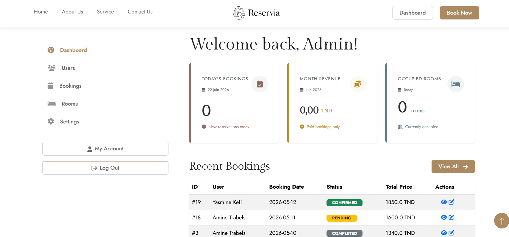

---

## 🔐 Fonctionnalités de sécurité

* Authentification des utilisateurs.
* Vérification par e-mail.
* Protection des données utilisateurs.
* Validation des formulaires.
* Gestion des rôles.

---

## 👩‍💻 Réalisé dans le cadre d'un projet universitaire

Projet développé dans le cadre d'un travail académique portant sur les systèmes de réservation et la gestion hôtelière.

---
